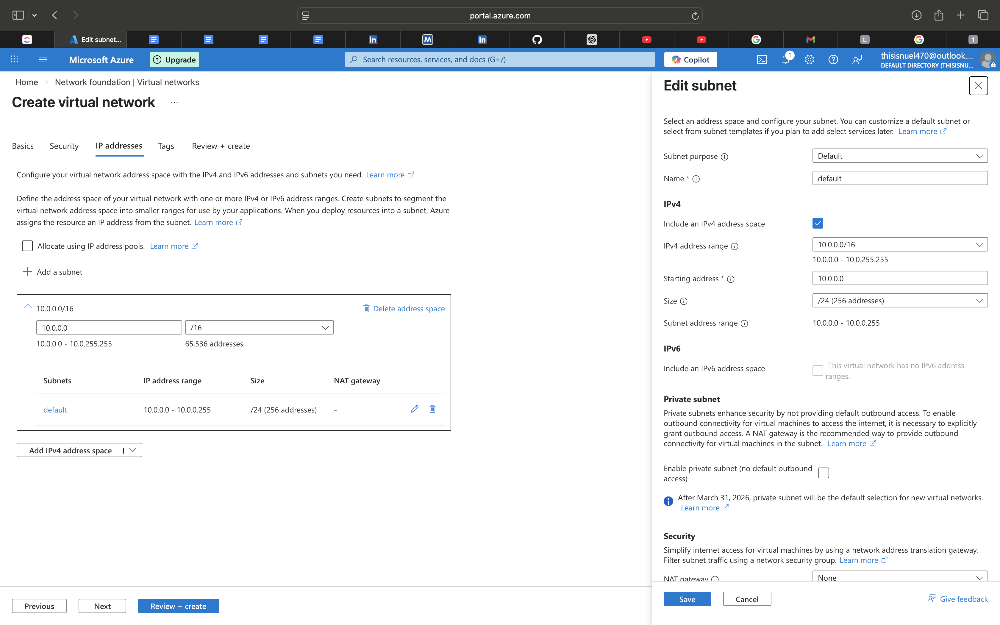
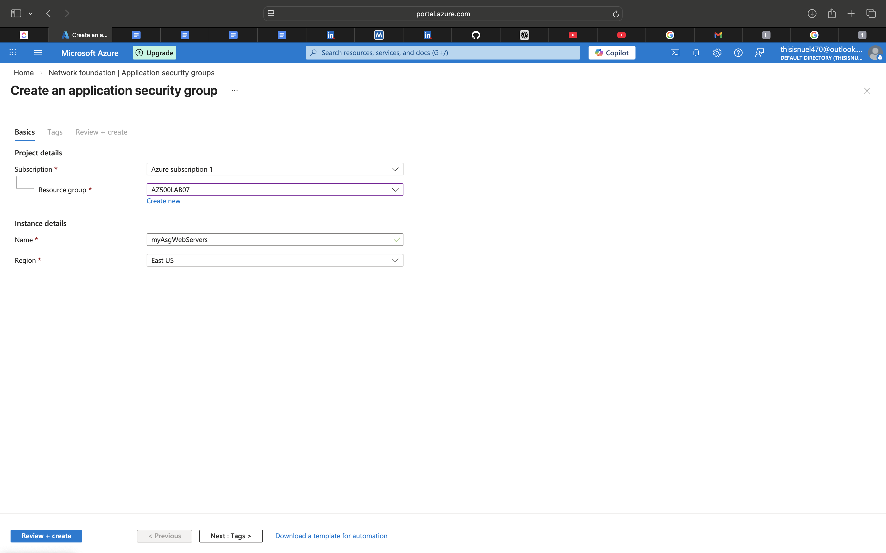
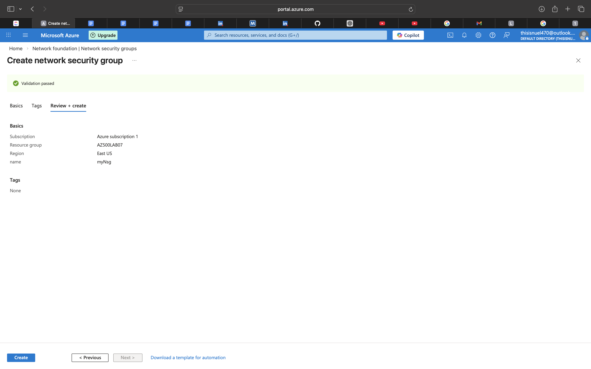
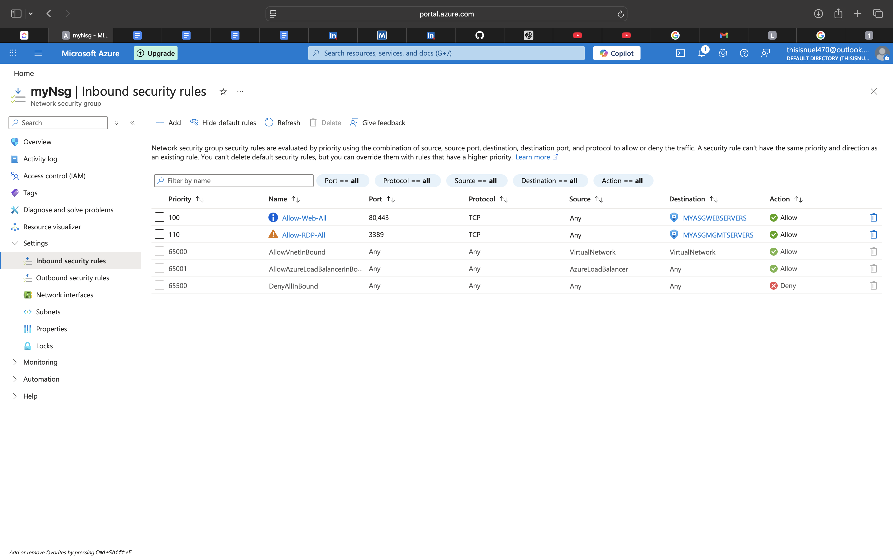
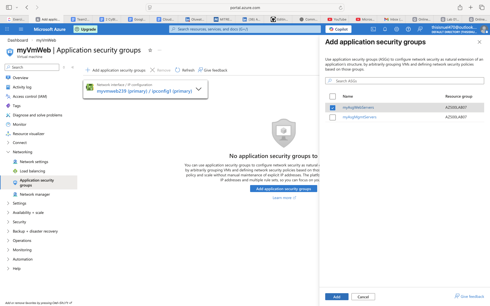
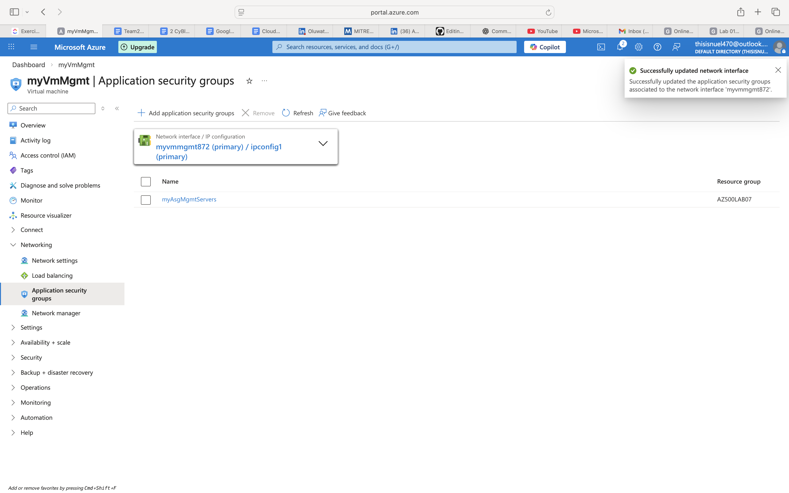
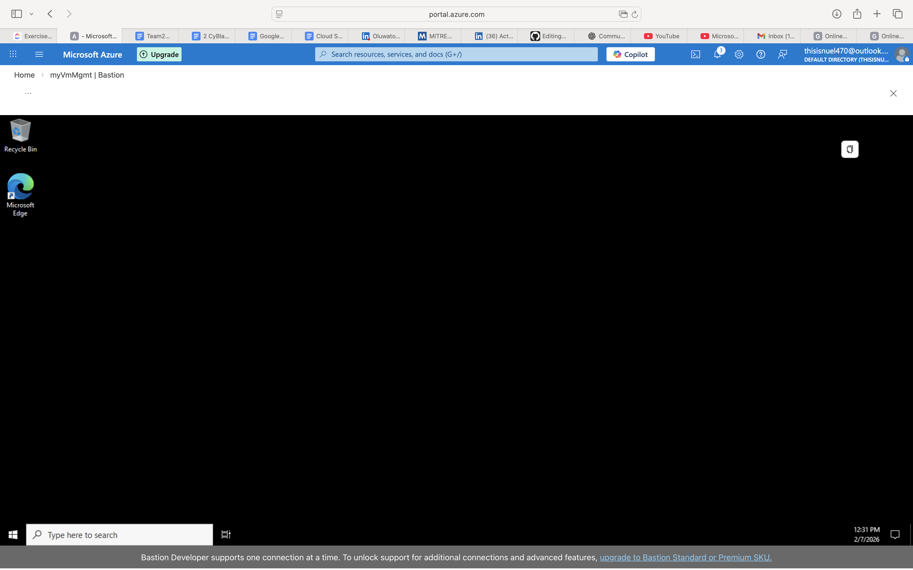
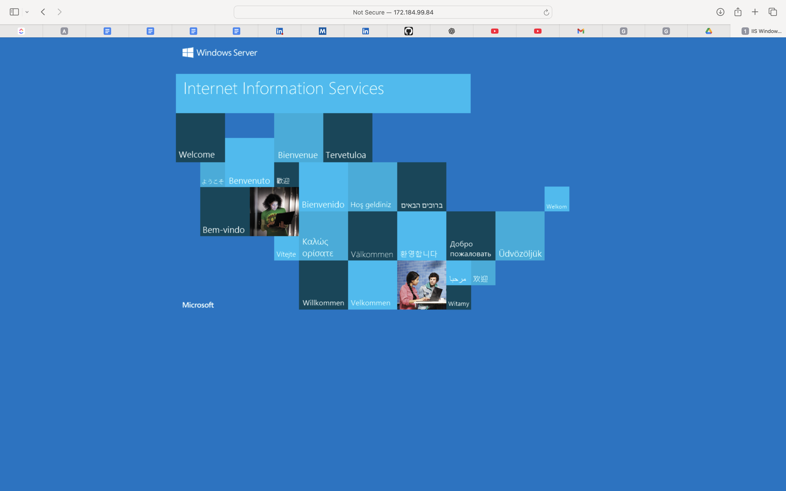

# Azure Network Segmentation Using ASGs and NSGs

## Overview

This lab demonstrates the implementation of secure virtual networking in Microsoft Azure using Network Security Groups (NSGs) and Application Security Groups (ASGs).  

The objective was to design and enforce controlled network access between two server tiers: Web Servers and Management Servers, in accordance with best security practices

## Lab Scenario

The organization requires:

- Two groups of servers:
  - Web Servers
  - Management Servers
- Each group must be placed in its own Application Security Group (ASG).
- RDP access must be allowed only to Management Servers.
- Web Servers must display the IIS default web page when accessed from the Internet.
- Network Security Group (NSG) rules must enforce traffic control.

## Lab Objectives

### Create the Virtual Networking Infrastructure  
### Deploy Virtual Machines and Test Network Filters  

# Virtual Networking Infrastructure

## Creating a Virtual Network

**Steps performed:**

1. Created a Virtual Network (VNet).
2. Configured one subnet within the VNet.
3. Selected the appropriate Azure region.
4. Verified successful deployment.

<strong>Figure 1: Creating a Virtual Network</strong>

  

**Purpose:**  
Establishes an isolated cloud network infrastructure to host virtual machines securely.

## Creating Application Security Groups

**Steps performed:**

1. Created an ASG named **WebServers-ASG**.
2. Created an ASG named **ManagementServers-ASG**.
3. Verified that both ASGs were successfully provisioned.

<strong>Figure 2: Creating Application Security Group for the Web Servers </strong>

  

<strong>Figure 3: Creating Application Security Group for the Management Servers </strong>

  

**Purpose:**  
Enables logical grouping of virtual machines for simplified and scalable security rule management.

## Creating and Configuring Network Security Group

**Steps performed:**

1. Created a Network Security Group (NSG).
2. Configured inbound security rule settings.
3. Associated the NSG with the subnet created earlier.

<strong>Figure 4: Creating Network Security Group </strong>

  

**Purpose:**  
Applies centralized network filtering policies at the subnet level.

## Configuring Inbound NSG Security Rules

**Steps performed:**

1. Created inbound rule to allow HTTP (Port 80) traffic to **WebServers-ASG**.
2. Created inbound rule to allow RDP (Port 3389) traffic to **ManagementServers-ASG**.
3. Verified priority and source settings.
4. Ensured default deny rule blocks unauthorized traffic.

<strong>Figure 5: Configuring Inbound NSG Rules for Web and Management Servers</strong>

  

**Purpose:**  
Implements fine-grained access control using ASG-based targeting and enforces the principle of least privilege.

# Deploying Virtual Machines and Testing Network Filters

**Steps performed:**

1. Deployed Web Server VM and assigned it to **WebServers-ASG**.
2. Installed IIS role on the Web Server.
3. Deployed Management Server VM and assigned it to **ManagementServers-ASG**.
4. Tested RDP access:
   - Successful connection to Management Server.
5. Tested web access:
   - IIS default page successfully displayed from internet browser.

<strong>Figure 6: Assigning the Web Server VM to the Web Server ASG</strong>

  

<strong>Figure 7: Installing the IIS role on the Web Server VM</strong>

  

<strong>Figure 8: Assigning the Management Server VM to the Management Server ASG</strong>

  

<strong>Figure 9: Successful RDP access to the Management Servers</strong>

  

<strong>Figure 10: Web Server VM assigned Public IP address 172.184.99.84</strong>

  

<strong>Figure 11: IIS default page successfully displayed from internet browser</strong>

  

# Security Concepts Demonstrated

- Network segmentation using Virtual Networks
- Application Security Group-based rule targeting
- Role-based traffic filtering with NSGs
- Principle of Least Privilege
- Controlled administrative access (RDP restriction)
- Internet-facing web service configuration (HTTP only)

# Key Learning Outcomes

- Designed secure multi-tier network architecture in Azure.
- Implemented subnet-level network security enforcement.
- Used ASGs to simplify scalable rule management.
- Applied NSG priority and rule evaluation logic.
- Tested and validated network access controls effectively.

# Conclusion

This lab demonstrates practical implementation of Azure network security controls using NSGs and ASGs to protect cloud workloads. By enforcing restricted administrative access and controlled internet exposure, the lab reflects real-world enterprise security design principles.

